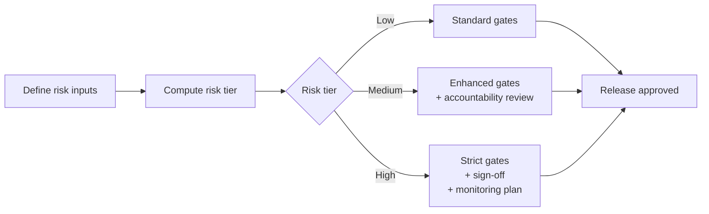

# AI Release Governance Framework

[](LICENSE)
[](https://github.com/simaba/ai-release-governance-framework/commits/main)
[](https://github.com/simaba/ai-release-governance-framework/stargazers)

A practical framework for **AI release readiness**, **risk-based gating**, and **accountability design** in regulated or safety-critical systems.

This repository is intentionally documentation-first and lightweight — designed to be adapted, not just read.

> **Start here:** see [`START_HERE.md`](START_HERE.md) for a guided entry point into the framework.

---

## Why this matters

AI systems often fail in production not because the model is weak, but because:

- release processes are inherited from deterministic software
- fallback and degraded-mode behaviour is under-specified
- monitoring is insufficient
- accountability is fragmented

This framework gives teams a structured way to release AI capabilities with clearer control, traceability, and operational confidence.

---

## How it works



**Risk inputs assessed:** safety impact · regulatory exposure · observability maturity · fallback readiness

**Risk tiers:** Low / Medium / High — each with corresponding release gates, accountability requirements, and monitoring expectations.

---

## What's included

```
docs/
  overview.md           # Framework overview and design rationale
  risk-model.md         # Risk dimensions and tier definitions
  release-gates.md      # Gate requirements by risk tier
  accountability.md     # Human oversight and traceability design
src/                    # Reference implementation (risk scoring scaffold)
templates/              # Reusable artefacts for your team
examples/               # Worked scenarios
START_HERE.md           # Guided entry point
CONTRIBUTING.md
SECURITY.md
CITATION.md             # How to cite this work
```

---

## Who this is for

- AI platform and MLOps teams
- Governance and risk leads in regulated industries
- Product managers designing AI feature releases
- Compliance and safety teams assessing AI deployments

---

## Non-goals

- This is not a compliance template or legal document
- This does not include proprietary or employer-specific content
- This is not a product — it is a reference framework to adapt

---

## Related repositories

This repository is part of a connected toolkit for responsible AI operations:

| Repository | Purpose |
|-----------|---------|
| [Enterprise AI Governance Playbook](https://github.com/simaba/enterprise-ai-governance-playbook) | End-to-end AI operating model from intake to improvement |
| [AI Release Governance Framework](https://github.com/simaba/ai-release-governance-framework) | Risk-based release gates for AI systems |
| [AI Release Readiness Checklist](https://github.com/simaba/ai-release-readiness-checklist) | Risk-tiered pre-release checklists with CLI tool |
| [AI Accountability Design Patterns](https://github.com/simaba/ai-accountability-design-patterns) | Patterns for human oversight and escalation |
| [Multi-Agent Governance Framework](https://github.com/simaba/multi-agent-governance-framework) | Roles, authority, and escalation for agent systems |
| [Multi-Agent Orchestration Patterns](https://github.com/simaba/multi-agent-orchestration-patterns) | Sequential, parallel, and feedback-loop patterns |
| [AI Agent Evaluation Framework](https://github.com/simaba/ai-agent-evaluation-framework) | System-level evaluation across 5 dimensions |
| [Agent System Simulator](https://github.com/simaba/agent-system-simulator) | Runnable multi-agent simulator with governance controls |
| [LLM-powered Lean Six Sigma](https://github.com/simaba/LLM-powered-Lean-Six-Sigma) | AI copilot for structured process improvement |

---

*Shared in a personal capacity. Open to collaborations and feedback — connect on [LinkedIn](https://linkedin.com/in/simaba) or [Medium](https://medium.com/@bagheri.sima).*
